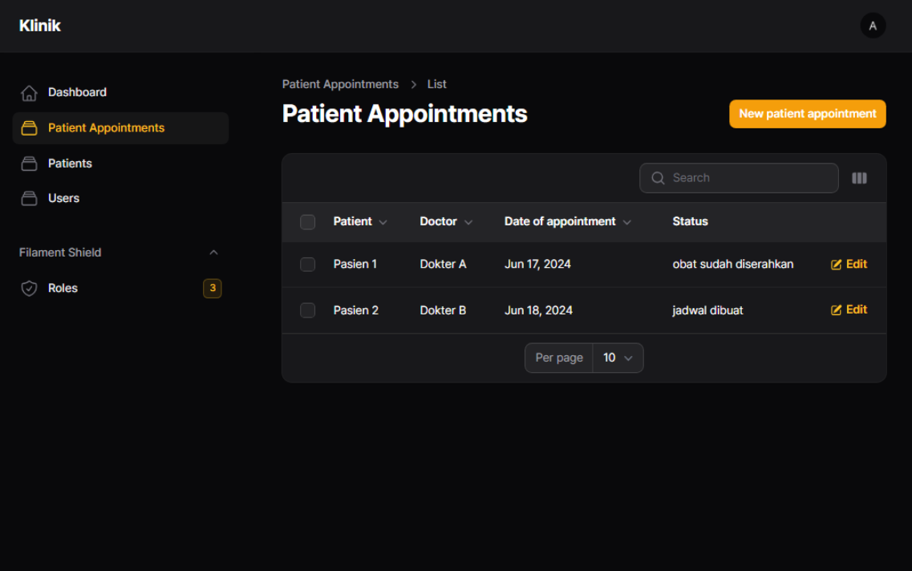

## Website Klinik

Website klinik adalah website untuk manajemen pasien di suatu klinik menggunakan Laravel dengan teknologi sebagai berikut:

- [Laravel 10](https://laravel.com/docs/10.x/releases).
- [Laravel Filament 3](https://filamentphp.com/docs/3.x/panels/installation) yang sudah terdapat Tailwind CSS di dalamnya.
- [Filament Shield](https://github.com/bezhanSalleh/filament-shield).

## Level User

- Admin
- Dokter
- Apoteker

## Fitur

Terdapat fitur yang berbeda di tiap level user.

### Fitur Admin

- Halaman Login
- Menu Logout
- Menu Dashboard
- Manajemen Janji Temu Pasien (CRUD)
- Manajemen Pasien (CRUD)
- Manajemen User (CRUD)
- Manajemen Role (CRUD)

### Fitur Dokter

- Halaman Login
- Menu Logout
- Menu Dashboard
- Manajemen Janji Temu Pasien (RUD)

## Fitur Apoteker

- Halaman Login
- Menu Logout
- Menu Dashboard
- Manajemen Janji Temu Pasien (RU)